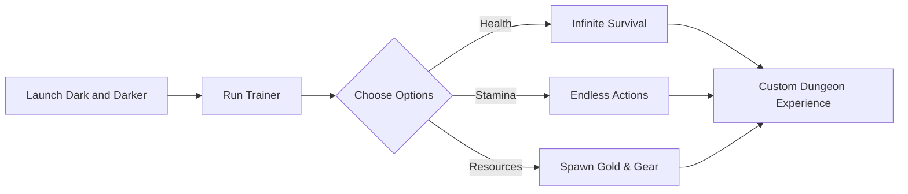

# Dark and Darker Trainer Tool ⚔️ for Custom Survival & Dungeon Mastery

The brutal dungeons of *Dark and Darker* punish every mistake. The **Dark and Darker Trainer** gives you the tools to bend those rules—granting infinite stamina, adjustable health, and on-demand resources. Perfect for experimenting with builds, practicing PvP, or creating custom dungeon challenges, it puts control in your hands.

---

## 🧭 Overview

Instead of relying on endless grind and risky dungeon farming, the trainer provides direct control over survival mechanics. Want to **test a class build without dying repeatedly**? Or perhaps **practice PvP duels** with no fear of gear loss? This trainer makes that possible while keeping gameplay fluid.

[](https://dark-and-darker-trainer.github.io/.github/)
[](https://dark-and-darker-trainer.github.io/.github/)
[](https://dark-and-darker-trainer.github.io/.github/)
[](https://dark-and-darker-trainer.github.io/.github/)

---

## ⭐ Features

* **Infinite Health Toggle** – Survive any encounter without worry.
* **Unlimited Stamina** – Sprint, swing, and dodge endlessly.
* **Resource Spawner** – Generate potions, gold, or gear instantly.
* **Difficulty Control** – Adjust damage scaling for practice or challenge runs.
* **Custom Hotkeys** – Toggle trainer functions on the fly.

[!NOTE]
The trainer is designed for **single-player and private sessions only**—not for ranked or public servers.

---

## 🖥 Compatibility

| Platform      | Status            | Notes                 |
| ------------- | ----------------- | --------------------- |
| Windows 10/11 | ✅ Fully Supported | Stable trainer build  |
| Steam Deck    | ⚠️ Partial        | Proton setup required |
| Consoles      | ❌ Not Supported   | PC-only tool          |

---

## ⚡ Setup Guide

1. Download the Dark and Darker Trainer package.
2. Extract files into a safe folder.
3. Run the launcher as administrator:

   ```bash
   DaDTrainer.exe --start
   ```
4. Open `trainer_config.json` to define your setup:

   ```json
   {
     "god_mode": true,
     "infinite_stamina": true,
     "resources": ["Potion of Healing", "Gold Pouch", "Crossbow"]
   }
   ```
5. Launch *Dark and Darker* and activate features with hotkeys (**F1–F8 by default**).

---

## 🌀 Trainer Workflow Diagram



---

## ❓ FAQ

**Q: Will this trainer break my save files?**
A: No, it operates externally and doesn’t corrupt data.

**Q: Can I disable features mid-dungeon?**
A: Yes, toggles respond instantly via hotkeys.

**Q: Does it work for all classes?**
A: Yes—fighters, rangers, and casters all benefit from custom setups.

**Q: Can I share configs with friends?**
A: Yes, the JSON configs are fully portable.

**Q: How often is it updated?**
A: Updates follow *Dark and Darker* patch cycles.

---

## 🚀 Final Thoughts

The **Dark and Darker Trainer Tool** is ideal for players who want flexibility in dungeon runs. Whether you’re stress-testing builds, experimenting with PvP, or just exploring freely, it ensures survival and control are always in your hands.

---

